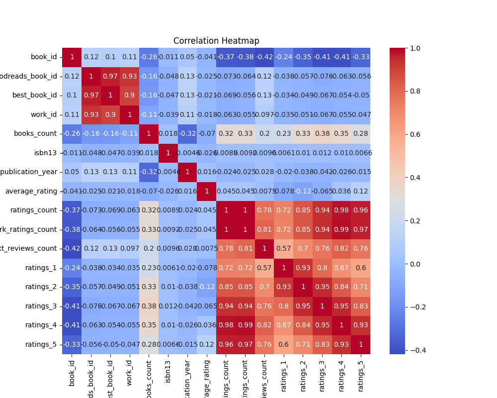
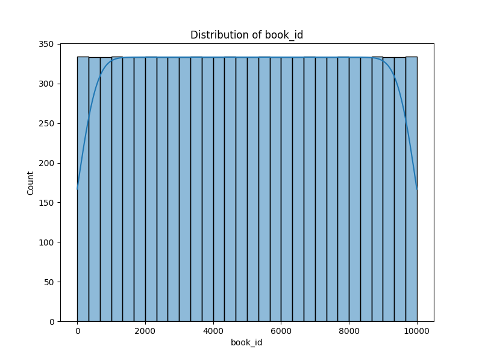
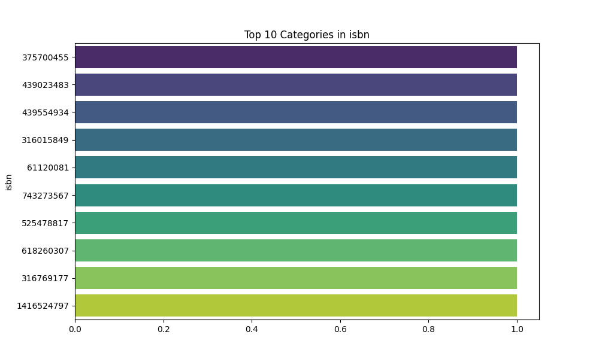

# README.md: Analysis of Book Dataset

## Dataset Overview
This dataset consists of various metrics related to books, primarily from a popular reading platform. We dissected both numeric and categorical features to uncover insights that inform book ratings, popularity, and authorial impact. 

### Numeric Columns:
- **book_id**: Unique identifier for the book.
- **goodreads_book_id**: Synchronizes with Goodreads’ own ID.
- **best_book_id**: Represents the book's best version in its category.
- **work_id**: Identifier for the specific work, including multiple editions.
- **books_count**: Total number of books by the author.
- **isbn13**: 13-digit International Standard Book Number.
- **original_publication_year**: Year when the book was first published.
- **average_rating**: Average score based on user reviews.
- **ratings_count**: Total number of ratings received.
- **work_ratings_count**: Ratings pertaining specifically to this work.
- **work_text_reviews_count**: Comprehensive text reviews for this work.
- **ratings_1-5**: Distribution of ratings from 1 (worst) to 5 (best).

### Categorical Columns:
- **isbn**: Different ISBN variations.
- **authors**: Authors who contributed to the book.
- **original_title**: Name of the work before translation or renaming.
- **title**: Current title used.
- **language_code**: Language of the text.
- **image_url**: Link to the book cover.
- **small_image_url**: Smaller version of the book cover.

---

## Key Insights

### 1. Correlation Insights
The correlation matrix reveals intriguing relationships among features, particularly the negative correlation between **books_count**, **ratings_count**, and other factors such as **average_rating** and **work_ratings_count**.

- **Ratings and Reviews**: A closer look at **ratings_count** shows strong positive correlations with higher ratings (especially **ratings_4** and **ratings_5**), indicating that more frequently rated books tend to earn higher scores.
- **Books Published Count**: Notably, as the **books_count** increases for an author, both ratings and average ratings seem to decline. This might suggest a dilution of quality as quantity increases or a variance in reader expectation.

### 2. Outlier Summary
Outliers were identified across several numerical metrics:

| Feature                    | Outlier Value |
|---------------------------|----------------|
| book_id                   | 0              |
| goodreads_book_id         | 345            |
| best_book_id              | 357            |
| work_id                   | 601            |
| books_count               | 844            |
| isbn13                    | 556            |
| original_publication_year  | 1031           |
| average_rating            | 158            |
| ratings_count             | 1163           |
| work_ratings_count        | 1143           |
| work_text_reviews_count    | 1005           |
| ratings_1                 | 1140           |
| ratings_2                 | 1156           |
| ratings_3                 | 1149           |
| ratings_4                 | 1131           |
| ratings_5                 | 1158           |

These extreme values could indicate data entry errors, or they might represent niche publications that behaved atypically in ratings or publication timing.

### 3. Missing Values Analysis
While the dataset displays a wealth of information, be mindful of potential missing values (not specifically highlighted here). Missing data could impact analyses related to popularity trends or nuanced author-specific insights. Imputing missing values or employing techniques such as data augmentation may be necessary to boost completeness.

---

## Visualizations
- 
- 
- 

These visuals represent the data’s distribution, clustering patterns, and leading ISBNs, which help in identifying popular genres or author demographics.

---

## Practical Applications
The insights gleaned can inform multiple stakeholders:
- **Authors and Publishers**: Identifying optimal book lengths and themes based on ratings and reviews.
- **Review Platforms**: Enhancing recommendations based on correlations between multiple ratings and reviews.
- **Marketing Teams**: Tailoring campaigns for authors with extensive book counts but lower ratings to improve brand perception.

---

## Big Picture Conclusions

In summary, our analysis illustrates that an author's prolific output can have varied implications on their work’s reception. While quantity may initially seem beneficial, focusing on quality remains crucial for maintaining high average ratings. The strong interdependencies revealed through our correlation analysis are crucial for predicting book success.

Lastly, to capitalize on our findings, stakeholders must regularly assess and adapt their strategies based on emerging data trends and reader preferences. In a competitive literary landscape, understanding these metrics allows for better decision-making and ultimately enhances reader satisfaction.