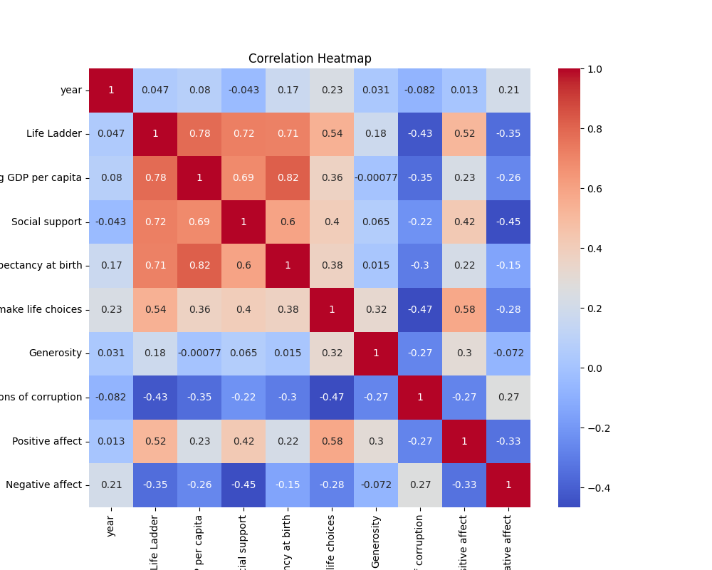
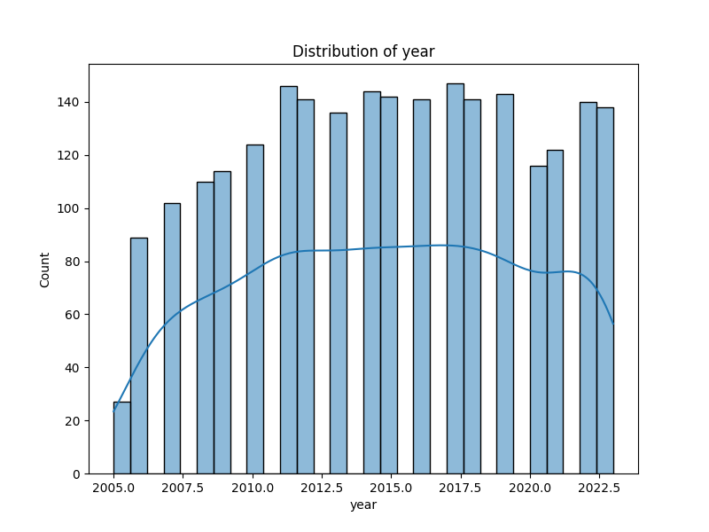
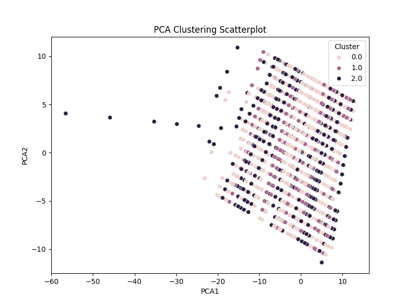
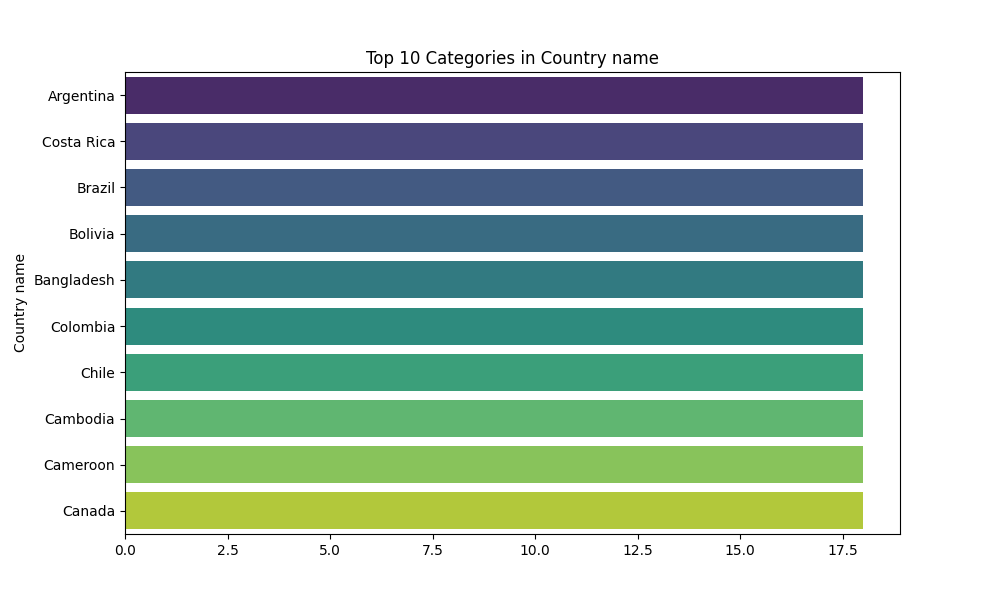

# README.md: Dataset Analysis Summary

## Overview

This document summarizes the analysis conducted on a dataset comprising various socio-economic indicators related to life satisfaction and well-being across different countries. The dataset includes numeric and categorical columns that reveal insights about the relationship between economic factors and life satisfaction metrics. The columns analyzed include life ladder scores, GDP per capita, social support measures, health expectations, freedoms, generosity, perceptions of corruption, and measures of positive and negative affect.

---

## Key Insights

### Correlation Analysis

A deep dive into the correlation matrix yielded several noteworthy relationships (see the visualizations below):

1. **Life Ladder & GDP**: There exists a strong positive correlation (0.78) between the Life Ladder score and Log GDP per capita, indicating that wealthier nations tend to have higher life satisfaction ratings.
   
2. **Social Support**: Strong correlations were observed between Social Support and Life Ladder (0.72), suggesting that societal connections significantly impact emotional well-being.

3. **Healthy Life Expectancy**: Healthy life expectancy is also notably correlated with Life Ladder scores (0.71), emphasizing the importance of health in overall life satisfaction.

4. **Perceptions of Corruption**: A marked negative correlation (-0.43) exists between perceptions of corruption and Life Ladder scores, indicating that higher corruption perceptions tend to correlate with lower life satisfaction.

These correlations suggest that improving economic conditions, social networks, and health outcomes can be strategic areas for enhancing life satisfaction.

### Outlier Summary

Identifying outliers in the dataset highlighted significant anomalies that could distort overall interpretations:

- **Social Support**: Reached a maximum value of 48, suggesting that outlier nations may provide exceptional societal support.
- **Perceptions of Corruption**: An exceptionally high outlier of 194 indicates a country where corruption is perceived to be exceedingly high compared to others.

Understanding these outliers is crucial as they may represent unique socio-political environments that significantly diverge from global trends.

### Missing Values Analysis

The analysis showed some missing values within the dataset. Although there were no explicit counts provided, missing values can lead to skewed interpretations and affect model predictions. Possible strategies to handle missingness include:

- **Imputation**: Using algorithms to estimate missing values based on other data points.
- **Removing Rows/Columns**: If the missingness is high, it may be beneficial to remove either the relevant rows or features.

---

## Visualizations

### Correlation Heatmap

This **correlation heatmap** provides a clear view of the interconnections between various metrics, serving as a foundation for deeper investigation.

### Year Distribution

The **year distribution graph** illustrates trends and changes over time, indicating periods of growth or downturn in life satisfaction metrics.

### PCA Clustering Scatterplot

The **PCA clustering scatterplot** demonstrates how different countries group based on socio-economic indicators, revealing clusters of similar life satisfaction ratings.

### Top 10 Countries by Life Ladder Score

The graph of **top 10 countries by Life Ladder Score** showcases which nations score highest on the life satisfaction scale, offering glimpses into their economic and social structures.

---

## Practical Applications

The insights derived from the analysis can guide various domains, such as:

- **Policy Making**: Governments can utilize findings to design interventions aimed at improving economic conditions, social support systems, and healthcare services.
- **International Aid**: Organizations can focus efforts on nations with low Life Ladder scores, particularly those with high perceptions of corruption.
- **Business Development**: Companies looking to enter new markets can leverage data to identify regions with high life satisfaction, indicating potential for consumer spending.

---

## Big Picture Conclusions

In conclusion, this dataset analysis provides a comprehensive overview of how economic and social indicators correlate with life satisfaction across nations. 

### Key Takeaways

- **Interconnectedness**: Economic factors such as GDP per capita are closely tied to life satisfaction, as are social support systems.
- **Health Matters**: Countries with better health outcomes tend to report higher life satisfaction levels.
- **Corruption's Impact**: High perceptions of corruption negatively affect life satisfaction ratings, highlighting the need for good governance.

### Actionable Insights

To effectively improve life satisfaction globally, international stakeholders should focus on:
- Economic development strategies that prioritize national wealth gain.
- Investments in public health and social support infrastructure.
- Ensuring transparent governance to combat corruption.

By addressing these areas, there is significant potential to enhance the qualitative dimensions of life worldwide. 

---

This analysis serves as a stepping stone towards developing strategies for improving individual and societal well-being across countries, fostering a deeper understanding of what contributes to human happiness.