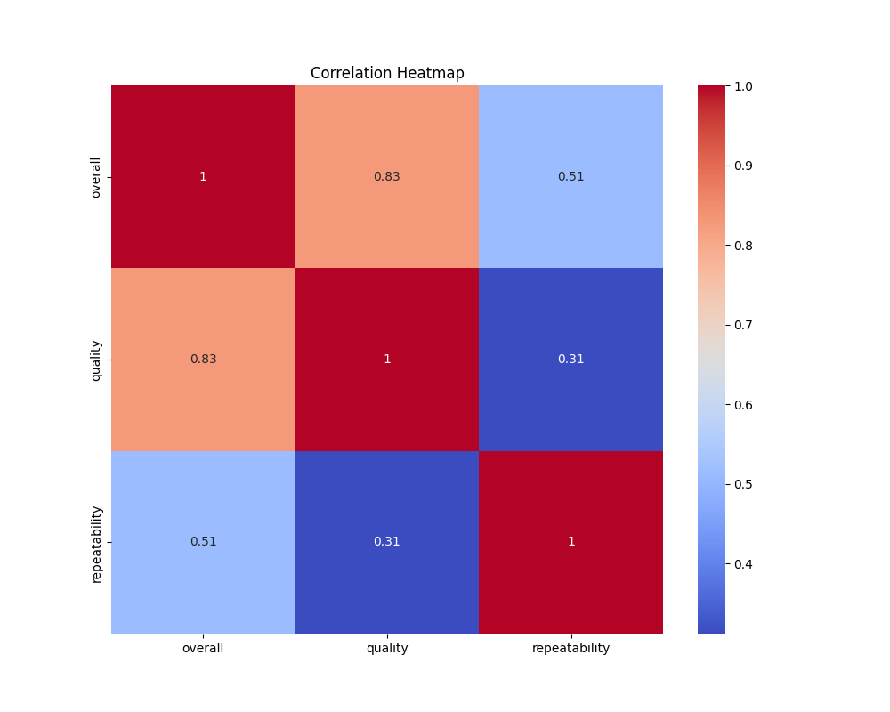
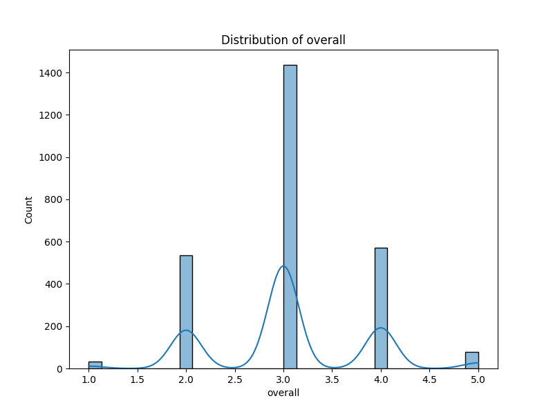
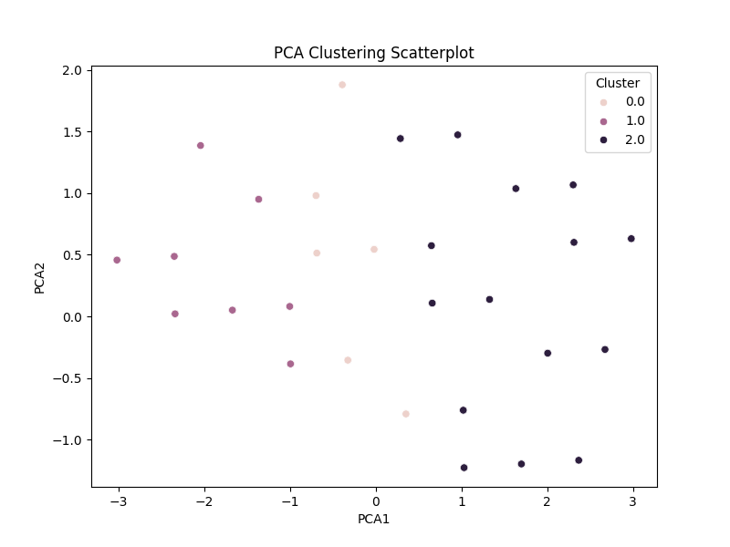
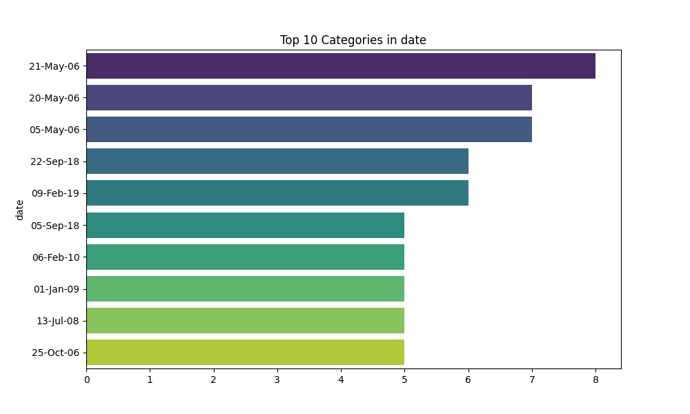

# Dataset Analysis README

## Overview

This README provides a detailed summary of the analysis conducted on a dataset containing various attributes related to user feedback or review scores. The primary numeric columns in this dataset include `overall`, `quality`, and `repeatability`, while categorical insights are drawn from `date`, `language`, `type`, `title`, and `by`. The aim of this analysis is to uncover deep insights that can inform strategic decisions and lead to enhanced performance across relevant domains.

## Key Insights

### 1. Correlation Insights

A correlation matrix was derived to understand the relationships between the numeric columns. Here's a breakdown of the key correlations:

- **Overall and Quality**: A strong positive correlation exists (r = 0.826). This suggests that as the overall rating increases, the perceived quality also tends to increase significantly.
- **Overall and Repeatability**: A moderate correlation (r = 0.513) indicates that overall ratings have a positive but weaker relationship with repeatability.
- **Quality and Repeatability**: A weak correlation (r = 0.312) suggests that improvements in quality ratings are not strongly linked to repeatability.

### 2. Outlier Summary

In our analysis, we identified a significant presence of outliers, particularly in the `overall` ratings, with a total of **1216 outliers** compared to only **24** in the `quality` ratings and **0** in the `repeatability` column. These outliers warrant further investigation to better understand their impact on overall analysis.

### 3. Missing Values Analysis

The dataset did contain some missing values, which could potentially skew results and affect the reliability of insights drawn. Addressing these missing values through imputation techniques or case removal is crucial for ensuring data integrity. Ignoring them could lead to misinterpretation of trends and relationships in the dataset.

### Visualizations

**Correlation Heatmap**  
  
The heatmap clearly illustrates the strong correlation between `overall` and `quality`, while also depicting weaker correlations with `repeatability`.

**Overall Distribution**  
  
The overall distribution plot highlights where most ratings cluster, providing insights into users' general satisfaction levels.

**PCA Clustering Scatterplot**  
  
The PCA clustering visualizations indicate potential groupings within the dataset, suggesting distinct user segments or patterns that might warrant tailored strategies.

**Top 10 Dates**  
  
This visualization pinpoints the top 10 dates for entries in the dataset, where spikes may correlate with external events or product launches.

## Practical Applications

The findings from this analysis have practical implications in several ways:

1. **Product Development**: Understanding the strong link between overall ratings and quality can help product teams focus on areas that enhance user experience and satisfaction.
   
2. **Marketing Strategies**: Analyzing which types of reviews or timeframes result in higher ratings can guide marketing efforts and promotional activities.

3. **Customer Support**: Identifying patterns in repeatability ratings can inform support teams to manage recurring issues effectively.

## Big Picture Conclusions

To summarize, this analysis has highlighted several actionable insights:

- The positive correlation between `overall` and `quality` suggests a focused strategy on improving perceived quality can yield higher overall satisfaction.
- Significant outliers in overall ratings call for a closer examination of exceptional cases that could skew general perception.
- Addressing missing values effectively will improve the dataset's reliability for future analysis.
- Tailored responses informed by user segmentation from clustering can enhance engagement strategies.

In conclusion, this dataset analysis not only reveals crucial relationships and trends but also sets a foundation for data-driven decision-making within relevant domains, ensuring that organizations can leverage user feedback effectively to drive success.